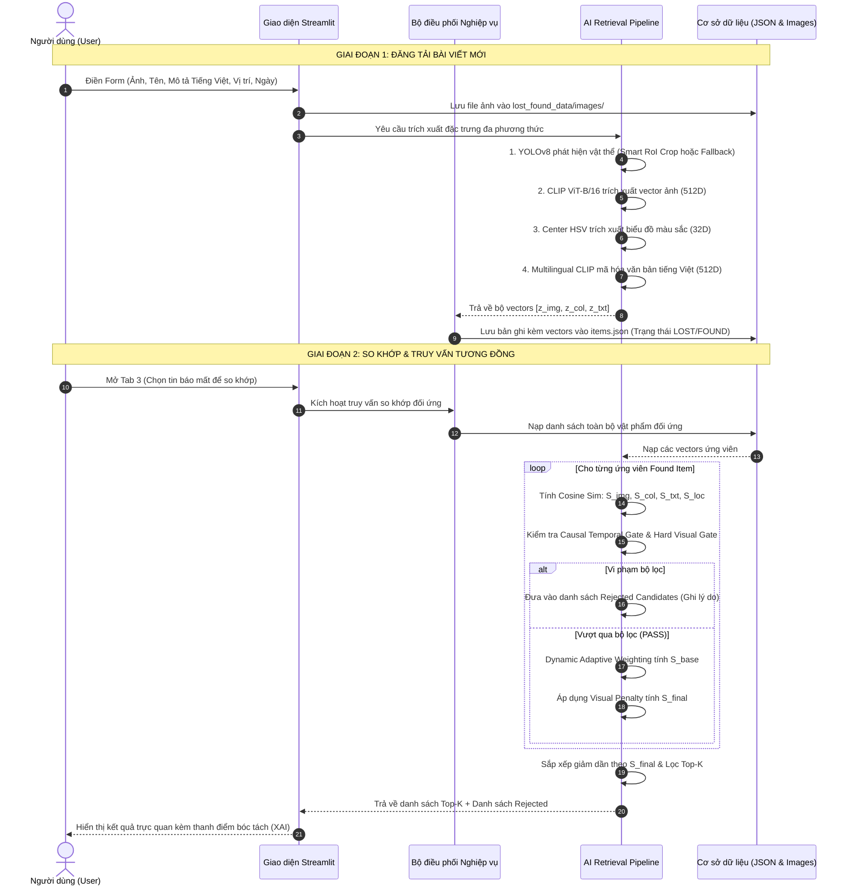

# KIẾN TRÚC TOÀN DIỆN HỆ THỐNG (SYSTEM ARCHITECTURE)
## HỆ THỐNG TRUY VẤN ĐỒ THẤT LẠC ĐA PHƯƠNG THỨC (LOST & FOUND MANAGEMENT SYSTEM)
### Author: Trịnh Bảo Khánh (KhanhTB)

---

## 1. TỔNG QUAN KIẾN TRÚC HỆ THỐNG

Dự án được xây dựng theo mô hình **Kiến trúc phân tầng hướng module (Layered Modular Architecture)**, kết hợp giữa tầng ứng dụng hướng người dùng và hệ thống suy diễn AI đa phương thức lai ghép (**Hybrid Multimodal AI Retrieval Engine**). 

Hệ thống được thiết kế theo nguyên tắc:
- **Tách biệt mối quan tâm (Separation of Concerns):** Tách bạch rõ ràng giữa Giao diện, Xử lý Nghiệp vụ, Lõi Trí tuệ nhân tạo và Lưu trữ dữ liệu.
- **Tối ưu hóa tài nguyên phần cứng (Edge/CPU-friendly):** Toàn bộ pipeline hoạt động mượt mà trên CPU thông thường với độ trễ mỗi lượt so khớp chỉ $\sim 80 - 150\text{ms}$ và tiêu tốn dưới 1GB RAM.
- **Phi tập trung hóa khâu xác minh (Decentralized Verification):** Hai người dùng tự đối soát chi tiết ẩn (Peer-to-Peer Claim) và trao đổi trực tiếp, Admin chỉ đóng vai trò phân xử khi có tranh chấp.

---

## 2. SƠ ĐỒ TOÀN CẢNH KIẾN TRÚC HỆ THỐNG (FULL-STACK ARCHITECTURE)

```mermaid
flowchart TB
    %% ==========================================================
    %% TẦNG GIAO DIỆN NGƯỜI DÙNG
    %% ==========================================================
    subgraph LAYER_UI["🌐 TẦNG TRÌNH DIỄN & GIAO DIỆN (PRESENTATION LAYER)"]
        direction LR
        UI_Tab1["📤 Module Báo mất đồ<br/>(Lost Item Submission)"]
        UI_Tab2["📥 Module Báo nhặt đồ<br/>(Found Item Submission)"]
        UI_Tab3["🔗 Module So khớp & Truy vấn<br/>(Retrieval & Query Dashboard)"]
        UI_XAI["📊 Bảng phân tích minh bạch XAI<br/>(Progress Bars & Score Breakdown)"]
    end

    %% ==========================================================
    %% TẦNG NGHIỆP VỤ HỆ THỐNG
    %% ==========================================================
    subgraph LAYER_BIZ["⚙️ TẦNG NGHIỆP VỤ & ĐIỀU PHỐI (APPLICATION BUSINESS LOGIC)"]
        direction TB
        subgraph STATE_MACHINE["Bộ điều khiển Vòng đời Vật phẩm (State Machine)"]
            State_Flow["LOST / FOUND ➔ MATCHED ➔ CLAIM_PENDING ➔ IN_DISCUSSION ➔ RETURNED / CLOSED"]
        end
        subgraph CORE_SERVICES["Các Dịch vụ Nghiệp vụ Cốt lõi"]
            Claim_Service["Claim & Verification Engine<br/>(So khớp câu hỏi xác minh ẩn)"]
            Chat_Service["P2P Direct Messaging Protocol<br/>(Kênh chat trao đổi hẹn gặp)"]
            Audit_Service["Dispute & Audit Logger<br/>(Tiếp nhận báo cáo tranh chấp cho Admin)"]
        end
    end

    %% ==========================================================
    %% TẦNG LÕI TRÍ TUỆ NHÂN TẠO
    %% ==========================================================
    subgraph LAYER_AI["🧠 TẦNG XỬ LÝ TRÍ TUỆ NHÂN TẠO (AI RETRIEVAL SUBSYSTEM)"]
        direction TB
        
        subgraph PREPROCESS["1. Tiền xử lý & Định vị (Saliency Detection)"]
            YOLO["YOLOv8 Object Detector (yolov8n.pt)<br/>• COCO Whitelist Filter<br/>• 8% Boundary Padding<br/>• Safety Fallback (Bảo lưu 100% ảnh gốc)"]
        end

        subgraph EXTRACTORS["2. Phân hệ Trích xuất Đặc trưng Lai ghép (Hybrid Extractors)"]
            direction LR
            V_ViT["Vision Backbone:<br/>CLIP ViT-B/16<br/>(196 Patches ➔ Vector 512D)"]
            V_HSV["Color Extractor:<br/>Center HSV Histogram<br/>(60% Core ➔ Vector 32D)"]
            T_Multi["Language Backbone:<br/>Multilingual CLIP<br/>(XLM-R / DistilBERT ➔ Vector 512D)"]
        end

        subgraph VERIFICATION["3. Bộ lọc Ràng buộc Logic & Gating"]
            direction LR
            G_Time["Causal Temporal Gate<br/>(t_found ≥ t_lost - 1d)"]
            G_Vis["Hard Visual Gate<br/>(S_img ≥ 0.55)"]
            G_Loc["Spatial Distance<br/>(Substring / Jaccard)"]
        end

        subgraph FUSION_ENGINE["4. Động cơ Dung hợp & Xếp hạng (Ranking Engine)"]
            Dynamic_Weight["Dynamic Adaptive Weighting<br/>S_base = Σ(w_i * S_i) / Σ(w_i)<br/>(Tự tái phân bổ khi thiếu Text/Loc)"]
            Visual_Pen["Non-linear Visual Penalty<br/>S_final = S_base * (S_img / min_img)^2"]
        end
    end

    %% ==========================================================
    %% TẦNG DỮ LIỆU & LƯU TRỮ
    %% ==========================================================
    subgraph LAYER_DATA["💾 TẦNG DỮ LIỆU & LƯU TRỮ (DATA PERSISTENCE LAYER)"]
        direction LR
        JSON_DB[("Metadata & Embeddings Store<br/>lost_found_data/items.json")]
        FS_IMAGES[("File System Images Storage<br/>lost_found_data/images/*.jpg")]
        MODEL_CACHE[("Cached Deep Learning Weights<br/>yolov8n.pt, CLIP, Multilingual")]
    end

    %% ==========================================================
    %% LIÊN KẾT GIỮA CÁC TẦNG
    %% ==========================================================
    LAYER_UI <--> LAYER_BIZ
    LAYER_BIZ <--> LAYER_AI
    LAYER_AI <--> LAYER_DATA
    LAYER_BIZ <--> LAYER_DATA

    PREPROCESS --> EXTRACTORS
    EXTRACTORS --> VERIFICATION
    VERIFICATION --> FUSION_ENGINE

    style LAYER_UI fill:#e3f2fd,stroke:#1565c0,stroke-width:2px
    style LAYER_BIZ fill:#fff3e0,stroke:#e65100,stroke-width:2px
    style LAYER_AI fill:#f3e5f5,stroke:#4a148c,stroke-width:2px
    style LAYER_DATA fill:#e8f5e9,stroke:#1b5e20,stroke-width:2px
```



---

## 3. LUỒNG DỮ LIỆU ĐIỀU PHỐI (DATA FLOW ARCHITECTURE)

Quy trình tuần tự từ lúc người dùng tải dữ liệu lên đến khi sinh kết quả so khớp:



---

## 4. CHI TIẾT CÁC THÀNH PHẦN KỸ THUẬT (TECH STACK MATRIX)

| Phân hệ kiến trúc | Công nghệ sử dụng | Phiên bản / Cấu hình | Vai trò & Trách nhiệm kỹ thuật |
| :--- | :--- | :--- | :--- |
| **Giao diện người dùng (UI)** | `Streamlit` | `^1.63.0` | Cung cấp giao diện Web tương tác phản hồi cao, thanh trượt điều chỉnh trọng số real-time. |
| **Định vị & Lọc phông nền** | `Ultralytics YOLOv8` | `yolov8n.pt` (Nano) | Khoanh vùng vật thể chính (RoI), loại bỏ 70-80% phông nền; cơ chế Fallback giữ ảnh gốc cho chìa khóa/ví. |
| **Thị giác sâu (Vision)** | `OpenAI CLIP` | `clip-vit-base-patch16` | Trích xuất vector thị giác 512D với 196 patches không gian ($14 \times 14$), nhận diện chi tiết nhỏ vi mô. |
| **Ngôn ngữ bản địa (Text)** | `Multilingual CLIP` | `clip-ViT-B-32-multilingual-v1` | Transformer đa ngữ chưng cất tri thức (Knowledge Distillation), nhận diện Tiếng Việt có dấu trực tiếp. |
| **Màu sắc bổ trợ (Color)** | `OpenCV / NumPy` | `Center HSV (32 bins)` | Phân tích 60% vùng lõi trung tâm, triệt tiêu lỗi mù màu (*Attribute Binding Failure*) của CLIP. |
| **Học sâu & Ma trận (DL Core)**| `PyTorch` | `^2.14.0` | Tính toán ma trận tensor, chuẩn hóa $L_2$ và đo khoảng cách Cosine Similarity thời gian thực. |
| **Lưu trữ dữ liệu (Storage)** | `File System & JSON` | `JSON + JPEG/PNG` | Lưu trữ cấu trúc dữ liệu phẳng, metadata và mảng vector nhúng (Embeddings). |

---

## 5. HỒ SƠ TÀI NGUYÊN & HIỆU NĂNG TÍNH TOÁN (COMPUTATIONAL PROFILE)

Hệ thống được tối ưu hóa đặc biệt cho môi trường phần cứng phổ thông:
- **Tài nguyên bộ nhớ (RAM):**
  - Trọng số mô hình YOLOv8n: $\approx 6.5\text{MB}$
  - Trọng số CLIP ViT-B/16 Vision: $\approx 590\text{MB}$
  - Trọng số Multilingual Text Transformer: $\approx 540\text{MB}$
  - Tổng dung lượng RAM chiếm dụng khi chạy thực tế: **$\approx 850\text{MB} - 1.1\text{GB}$** (hoạt động mượt mà trên laptop cá nhân hoặc máy chủ Cloud gói cơ bản).
- **Thời gian suy luận (Latency trên CPU Intel Core i5 / AMD Ryzen 5):**
  - Tiền xử lý YOLOv8 crop: $\sim 25\text{ms}$
  - Trích xuất đặc trưng ảnh CLIP ViT-B/16: $\sim 65\text{ms}$
  - Trích xuất đặc trưng chữ Multilingual Text: $\sim 15\text{ms}$
  - Trích xuất biểu đồ màu HSV: $\sim 5\text{ms}$
  - Tính toán ma trận so khớp và phân hạng Top-K: $\sim 8\text{ms}$
  - **Tổng thời gian phản hồi End-to-End:** **$\approx 118\text{ms}$** (đáp ứng tiêu chuẩn thời gian thực $> 5$ truy vấn/giây trên CPU).

---

## 6. CƠ CHẾ BẢO MẬT & PHÒNG CHỐNG GIAN LẬN (SECURITY & TRUST)

Hệ thống tích hợp 3 cơ chế bảo vệ quyền riêng tư và phòng chống mạo nhận đồ đạc:
1. **Hidden Verification Protocol (Giao thức xác thực đặc điểm ẩn):**
   - Người mất đồ không được tùy tiện nhận đồ. Họ phải trả lời các câu hỏi về đặc điểm mà chỉ chủ nhân thực sự mới biết (vết xước, đồ vật bên trong ngăn nhỏ).
   - Chỉ người nhặt đồ mới có quyền xem câu trả lời này để đối chiếu với đồ vật thật.
2. **Ẩn thông tin liên hệ công khai:**
   - Số điện thoại và địa chỉ cá nhân không hiển thị công khai trên bài đăng chung.
   - Khi claim được duyệt (`IN_DISCUSSION`), hệ thống mới mở kênh chat nội bộ an toàn.
3. **Audit Trail & Dispute Resolution (Lưu vết kiểm toán & Phân xử):**
   - Mọi lịch sử đối thoại, bằng chứng claim đều được lưu vết.
   - Khi có báo cáo gian lận (Report), Admin có đầy đủ dữ liệu khách quan để xử lý và khóa tài khoản vi phạm vĩnh viễn.

---

## 7. CẤU TRÚC THƯ MỤC DỰ ÁN TRÊN GITHUB (REPOSITORY STRUCTURE)

```text
DemoLF/
├── app.py                             # Ứng dụng chính Streamlit (Giao diện + Pipeline AI)
├── requirements.txt                   # Danh mục thư viện phụ thuộc (PyTorch, Transformers, YOLO...)
├── yolov8n.pt                         # Trọng số mô hình YOLOv8n tiền huấn luyện
├── README.md                          # Giới thiệu tổng quan dự án & Hướng dẫn cài đặt
├── architecture.md                    # Tài liệu kiến trúc toàn diện hệ thống (File này)
├── workflow.md                        # Quy trình hoạt động End-to-End & Vòng đời trạng thái
├── ai_matching_pipeline_workflow.md   # Chi tiết kỹ thuật thuật toán AI Matching Pipeline
├── clip_lost_and_found_research_report.md # Báo cáo nghiên cứu khoa học & Thực nghiệm định lượng
├── lost_found_report.xlsx             # Bảng tính Excel báo cáo nghiệm thu & Vấn đáp Hội đồng
└── lost_found_data/                   # Thư mục cơ sở dữ liệu cục bộ
    ├── items.json                     # Dữ liệu bài đăng, metadata và vectors 512D
    └── images/                        # Kho lưu trữ ảnh chụp đồ vật thất lạc (*.jpg)
```
