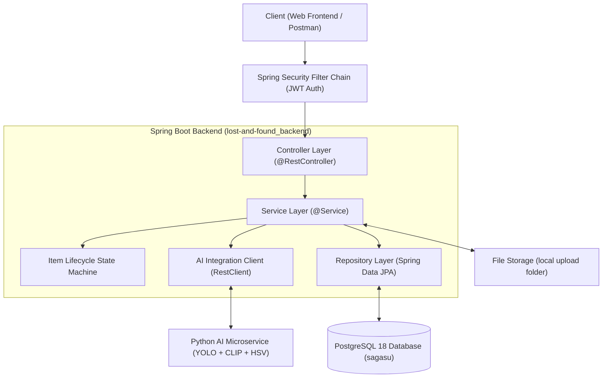
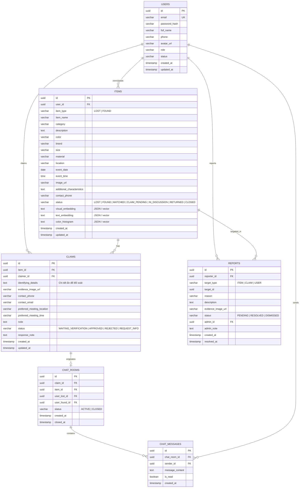
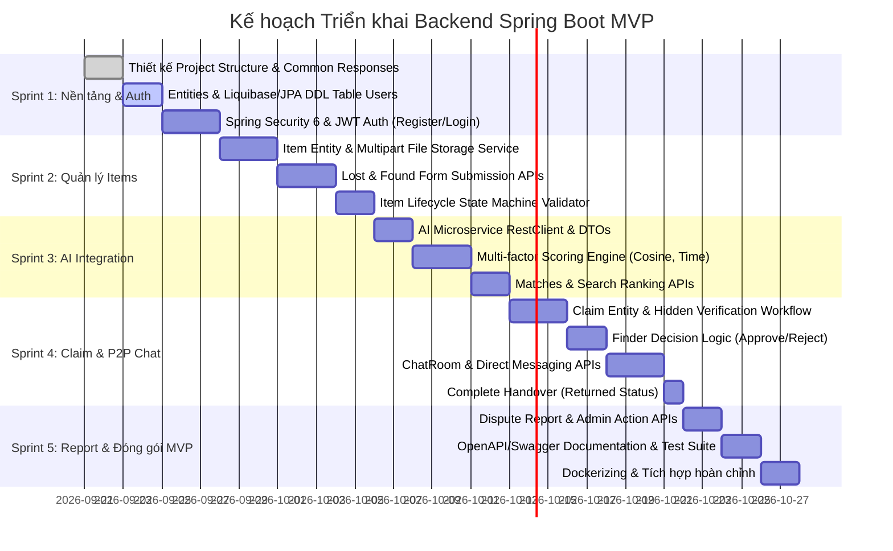

# SOFTWARE DESIGN DOCUMENT (SDD) & KẾ HOẠCH TRIỂN KHAI MVP
## BACKEND SPRING BOOT - HỆ THỐNG TÌM KIẾM ĐỒ THẤT LẠC SAGASU (LOST & FOUND)

- **Tên dự án:** Sagasu - Lost and Found Management Backend
- **Công nghệ nền tảng:** Spring Boot 4.x / Java 21 / PostgreSQL 18+ / Docker Compose
- **Phạm vi tài liệu:** Thiết kế chi tiết kiến trúc phần mềm (Software Design Document - SDD) và Kế hoạch triển khai giai đoạn MVP (Minimum Viable Product) chỉ dành riêng cho phân hệ **Spring Boot Backend**.

---

## 1. TỔNG QUAN & PHẠM VI MVP (MVP SCOPE & OBJECTIVES)

### 1.1. Mục tiêu hệ thống Backend
Spring Boot Backend đóng vai trò là **Bộ điều phối Nghiệp vụ trung tâm (Business Logic & Orchestration Layer)** và **Tầng lưu trữ dữ liệu bền vững (Data Persistence Layer)**:
1. Quản lý xác thực và phân quyền người dùng (User & Admin).
2. Quản lý vòng đời bài đăng đồ mất (`LOST`) và đồ nhặt được (`FOUND`) với máy trạng thái (State Machine) chặt chẽ.
3. Cung cấp chuẩn giao tiếp (Contract/API) kết nối với AI Retrieval Subsystem (dịch vụ trích xuất vector CLIP, Multilingual Text, YOLOv8 và HSV).
4. Thực thi quy trình xác thực ngang hàng phi tập trung (Peer-to-Peer Claim Verification) bằng câu hỏi đặc điểm ẩn.
5. Cung cấp kênh trò chuyện trực tiếp (Direct In-app Chat) giữa 2 bên khi Claim được duyệt.
6. Xử lý tranh chấp, báo cáo gian lận (Dispute/Report) dành cho Admin.

### 1.2. Phân định phạm vi: MVP vs. Post-MVP (Out of Scope)

| Phân hệ nghiệp vụ | Trong phạm vi MVP (In-Scope) | Ngoài phạm vi MVP (Post-MVP / Future) |
| :--- | :--- | :--- |
| **Xác thực & Người dùng** | - Đăng ký, Đăng nhập (JWT Stateless)<br>- Cập nhật thông tin cơ bản & Avatar<br>- Role: `ROLE_USER`, `ROLE_ADMIN` | - Quên mật khẩu qua email OTP/SMTP<br>- Đăng nhập mạng xã hội (Google OAuth2) |
| **Quản lý đồ vật (Items)** | - Đăng bài Lost Item & Found Item (15 trường)<br>- Upload ảnh cục bộ (Local Storage/Volume)<br>- CRUD bài đăng & Chuyển trạng thái theo quy trình | - Đính kèm nhiều hơn 1 ảnh chính<br>- Tích hợp S3/Cloudinary CDN |
| **Tìm kiếm & Matching** | - Tìm kiếm theo từ khóa + bộ lọc (Địa điểm, ngày, category)<br>- API kết nối AI Subsystem lấy vector & tính điểm đa yếu tố (Multi-factor: Ảnh, Chữ, Màu, Ràng buộc thời gian)<br>- API lấy danh sách Top-K Matched kèm điểm XAI | - Tối ưu tìm kiếm pgvector quy mô hàng triệu bản ghi HNSW<br>- Dynamic visual penalty tinh chỉnh động từ UI Admin |
| **Xác minh (Claim)** | - Người mất gửi Claim kèm mô tả đặc điểm ẩn<br>- Người nhặt duyệt: `APPROVE`, `REJECT`, `REQUEST_MORE_INFO`<br>- Đổi trạng thái bài đăng: `CLAIM_PENDING` $\rightarrow$ `IN_DISCUSSION` | - Tải nhiều ảnh bằng chứng quá khứ |
| **Trò chuyện (Chat)** | - Tự động tạo phòng chat khi Claim được `APPROVE`<br>- REST API gửi/nhận tin nhắn và lịch sử chat<br>- Đóng phòng chat khi bấm `RETURNED` | - WebSocket/STOMP streaming realtime nâng cao, voice/video call |
| **Tranh chấp & Admin** | - Gửi báo cáo vi phạm (`REPORT`) bài đăng/claim<br>- Admin khóa bài đăng hoặc khóa tài khoản vi phạm<br>- Thống kê số lượng bài đăng cơ bản | - Dashboard phân tích biểu đồ Recall@K, MRR chuyên sâu |

---

## 2. KIẾN TRÚC PHÂN TẦNG SPRING BOOT (SYSTEM ARCHITECTURE)

Dự án tuân thủ kiến trúc phân tầng chuẩn mực của Spring Boot:



### 2.1. Cấu trúc Package đề xuất (Layer-based Architecture - Minimal MVP)
```text
com.sagasu.lostandfound_backend/
├── common/                     # Tiện ích chung, base response, exception handling
│   ├── api/                    # ApiResponse<T>, PageResponse<T>
│   ├── exception/              # AppException, ErrorCode, GlobalExceptionHandler
│   └── util/                   # SecurityUtils
├── config/                     # Cấu hình hệ thống (Security, JWT, OpenAPI)
├── controller/                 # Tầng Controller tiếp nhận REST API request
│   ├── AuthController.java     # Đăng ký, đăng nhập, lấy thông tin cá nhân hiện tại
│   ├── UserController.java     # Cập nhật thông tin profile
│   └── ItemController.java     # Quản lý tin đồ mất (LOST), đồ nhặt được (FOUND)
├── service/                    # Tầng nghiệp vụ (Business Logic)
│   ├── AuthService.java
│   ├── UserService.java
│   └── ItemService.java
├── repository/                 # Tầng truy xuất dữ liệu (Spring Data JPA)
│   ├── UserRepository.java
│   └── ItemRepository.java
├── entity/                     # Các JPA Entity & Enums
│   ├── User.java, Role.java, UserStatus.java
│   └── Item.java, ItemType.java, ItemStatus.java
├── dto/                        # Data Transfer Objects (Request / Response)
│   ├── AuthResponse.java, LoginRequest.java, RegisterRequest.java, UserResponse.java
│   ├── UpdateProfileRequest.java
│   └── CreateItemRequest.java, ItemResponse.java, CloseItemRequest.java
└── LostAndFoundBackendApplication.java
```

---

## 3. THIẾT KẾ CƠ SỞ DỮ LIỆU (DATABASE SCHEMA DESIGN)

Cơ sở dữ liệu: **PostgreSQL 18** (Database name: `sagasu`).



### 3.1. Ma trận Chuyển đổi Trạng thái Đồ vật (State Machine Matrix)
Máy trạng thái bảo vệ tính toàn vẹn của dữ liệu:

| Trạng thái hiện tại | Sự kiện kích hoạt | Điều kiện kiểm tra | Trạng thái tiếp theo |
| :--- | :--- | :--- | :--- |
| *(None)* | Submit Lost Item | Role = USER | `LOST` |
| *(None)* | Submit Found Item | Role = USER | `FOUND` |
| `LOST` / `FOUND` | AI Phát hiện $S_{final} \ge 0.55$ | Matching Service | `MATCHED` |
| `FOUND` / `MATCHED` | Gửi Claim đặc điểm ẩn | Người gửi $\ne$ Finder | `CLAIM_PENDING` |
| `CLAIM_PENDING` | Finder từ chối (REJECT) | Caller là Finder | `FOUND` (hoặc `MATCHED`) |
| `CLAIM_PENDING` | Finder duyệt (APPROVE) | Caller là Finder | `IN_DISCUSSION` (Tạo Chat Room) |
| `IN_DISCUSSION` | Xác nhận đã trả đồ | Caller là Lost/Finder | `RETURNED` (Khóa Chat Room) |
| Bất kỳ | Phát hiện gian lận/tranh chấp | Admin xử lý | `CLOSED` |

---

## 4. ĐẶC TẢ TẬP HỢP API RESTful CHO MVP

Tất cả API trả về cấu trúc chuẩn:
```json
{
  "success": true,
  "code": 200,
  "message": "Thao tác thành công",
  "data": { ... }
}
```

### 4.1. Nhóm Xác thực (Auth API)
- `POST /api/v1/auth/register`: Đăng ký tài khoản (`fullName`, `email`, `phone`, `password`).
- `POST /api/v1/auth/login`: Đăng nhập nhận JWT Token (`email`, `password`).
- `GET /api/v1/auth/me`: Lấy thông tin tài khoản hiện tại.
- `PUT /api/v1/users/profile`: Cập nhật thông tin cá nhân.

### 4.2. Nhóm Đồ vật Thất lạc & Nhặt được (Item API)
- `POST /api/v1/items/lost`: Đăng bài Lost Item (Multipart: 15 fields + file ảnh).
- `POST /api/v1/items/found`: Đăng bài Found Item (Multipart: 15 fields + file ảnh).
- `GET /api/v1/items/{id}`: Xem chi tiết bài đăng (bao gồm ảnh, hiện trạng, địa điểm, thời gian).
- `GET /api/v1/items`: Danh sách bài đăng có phân trang & bộ lọc (`type`, `category`, `status`, `keyword`).
- `GET /api/v1/items/my-posts`: Danh sách bài đăng do chính user hiện tại tạo ("Đơn của tôi").
- `PUT /api/v1/items/{id}`: Chỉnh sửa thông tin bài đăng.
- `PATCH /api/v1/items/{id}/close`: Đánh dấu đã nhận lại đồ (`RETURNED`) hoặc đóng bài (`CLOSED`).

### 4.3. Nhóm So khớp & Tìm kiếm Tương đồng (Matching & Search API)
- `GET /api/v1/items/{id}/matches`: Lấy danh sách Top-K đồ vật đối ứng có điểm tương đồng cao nhất được AI gợi ý kèm bóc tách điểm XAI (`imageScore`, `textColorScore`, `timeValid`, `finalScore`).
- `POST /api/v1/search/text`: Tìm kiếm theo từ khóa văn bản và bộ lọc metadata.
- `POST /api/v1/search/image`: Upload ảnh tìm kiếm các Found Item tương đồng (Query Image).

### 4.4. Nhóm Xác minh Quyền sở hữu (Claim API - P2P Verification)
- `POST /api/v1/items/{itemId}/claims`: Gửi yêu cầu nhận đồ kèm đặc điểm nhận dạng ẩn (`identifyingDetails`, `evidenceImage`, `contactPhone`, `note`).
- `GET /api/v1/claims/received`: Finder xem danh sách Claim gửi tới các món đồ mình đang giữ.
- `GET /api/v1/claims/sent`: Claimer theo dõi danh sách Claim mình đã gửi đi.
- `GET /api/v1/claims/{id}`: Xem chi tiết câu trả lời xác minh của 1 claim.
- `PATCH /api/v1/claims/{id}/respond`: Finder phản hồi claim:
  - `decision`: `APPROVE` (tự động tạo Chat Room, chuyển item sang `IN_DISCUSSION`), `REJECT` (mở lại item), hoặc `REQUEST_INFO`.
  - `responseNote`: Lời nhắn phản hồi.

### 4.5. Nhóm Trò chuyện Trực tiếp (Chat API)
- `GET /api/v1/chat/rooms`: Lấy danh sách các phòng chat mà user đang tham gia.
- `GET /api/v1/chat/rooms/{roomId}/messages`: Lấy lịch sử tin nhắn trong phòng chat.
- `POST /api/v1/chat/rooms/{roomId}/messages`: Gửi tin nhắn mới vào phòng chat.

### 4.6. Nhóm Báo cáo Vi phạm & Phân xử (Dispute/Report API)
- `POST /api/v1/reports`: Người dùng gửi báo cáo vi phạm (`targetType`, `targetId`, `reason`, `description`, `evidenceImage`).
- `GET /api/v1/admin/reports`: Admin xem danh sách báo cáo cần xử lý.
- `PATCH /api/v1/admin/reports/{id}/resolve`: Admin đưa ra quyết định xử lý (Khóa bài, Khóa tài khoản vi phạm).

---

## 5. KẾ HOẠCH TRIỂN KHAI THEO GIAI ĐOẠN (MVP IMPLEMENTATION ROADMAP)

Kế hoạch được chia thành **5 Sprint** tuần tự, tập trung tối đa vào phần backend Spring Boot:



### Sprint 1: Cấu trúc Dự án, CSDL & Xác thực Người dùng (Auth)
- **Mục tiêu:** Xây dựng khung chuẩn, cấu hình kết nối DB PostgreSQL, cơ chế xử lý lỗi tập trung, hoàn tất module Auth.
- **Các công việc chính:**
  1. Tạo các class dùng chung: `ApiResponse<T>`, `ErrorCode`, `GlobalExceptionHandler`.
  2. Tạo Entity `User`, Enum `Role` (`ROLE_USER`, `ROLE_ADMIN`), `UserStatus`.
  3. Viết `UserRepository`, `UserService`, `AuthService`.
  4. Cấu hình Spring Security với JWT Authentication Filter, BCryptPasswordEncoder.
  5. Viết Controller `AuthController` với các endpoint: `/register`, `/login`, `/me`.
  6. Viết Unit/Integration Test cho Auth.

### Sprint 2: Nghiệp vụ Đồ Thất Lạc & Đồ Nhặt Được (Item Management)
- **Mục tiêu:** Cung cấp đầy đủ API đăng tin Lost Item và Found Item theo đặc tả 15 trường, lưu file ảnh và quản lý trạng thái ban đầu.
- **Các công việc chính:**
  1. Tạo Entity `Item` với đầy đủ các thuộc tính (tên, danh mục, màu sắc, địa điểm, toạ độ, thời gian, đặc điểm nhận dạng).
  2. Viết dịch vụ lưu trữ ảnh cục bộ `FileStorageService` (lưu file vào thư mục upload, map static URL).
  3. Viết `ItemService` xử lý logic tạo tin `POST /api/v1/items/lost` và `POST /api/v1/items/found`.
  4. Viết `ItemStateValidator` quản lý chuyển dịch trạng thái hợp lệ (`LOST`, `FOUND`, `RETURNED`, `CLOSED`).
  5. Xây dựng API lấy danh sách bài đăng có phân trang, lọc theo danh mục, vị trí, khoảng thời gian.

### Sprint 3: Tích hợp Giao tiếp AI & Multi-factor Matching
- **Mục tiêu:** Tích hợp với dịch vụ AI để trích xuất vector hoặc lưu trữ metadata vector, thực hiện tính toán so khớp đa phương thức.
- **Các công việc chính:**
  1. Thiết kế `AIServiceClient` sử dụng `RestClient` gọi sang AI Service (nhận ảnh/text $\rightarrow$ trả về vector 512D).
  2. Tạo bảng lưu trữ vector nhúng hoặc nhúng vector trực tiếp vào Entity `Item` (`visual_embedding`, `text_embedding`, `color_histogram`).
  3. Viết thuật toán tính điểm tổng hợp đa yếu tố (Multi-factor Ranking):
     - Kiểm tra Ràng buộc Thời gian ($t_{found} \ge t_{lost} - 1 \text{ ngày}$).
     - Cosine Similarity ảnh và mô tả văn bản tiếng Việt.
     - Center HSV Color Distance.
     - Tính điểm tổng hợp $S_{final}$ và áp dụng ngưỡng lọc ($S_{final} \ge 0.55$).
  4. Viết API `GET /api/v1/items/{id}/matches` trả về danh sách Top-K đồ vật đối ứng kèm bóc tách điểm XAI.

### Sprint 4: Quy trình Xác minh Đồ đạc (P2P Claim) & Kênh Chat Trực Tiếp
- **Mục tiêu:** Hiện thực hóa cơ chế đối soát đặc điểm ẩn giữa người mất và người nhặt, kích hoạt kênh trò chuyện tự động khi duyệt.
- **Các công việc chính:**
  1. Tạo Entity `Claim`, `ChatRoom`, `ChatMessage`.
  2. Viết API `POST /api/v1/items/{itemId}/claims`: Người mất gửi câu trả lời đặc điểm ẩn (chỉ finder mới được đọc). Chuyển item sang `CLAIM_PENDING`.
  3. Viết API `PATCH /api/v1/claims/{id}/respond`:
     - Nếu `APPROVE`: Tự động khởi tạo `ChatRoom` liên kết giữa hai người, chuyển item sang `IN_DISCUSSION`.
     - Nếu `REJECT`: Hủy claim, hoàn trả item về trạng thái `FOUND`/`MATCHED`.
  4. Viết các endpoint Chat: Lấy danh sách tin nhắn, gửi tin nhắn mới.
  5. Viết API `PATCH /api/v1/items/{id}/close` (chủ bài đăng xác nhận đã nhận lại đồ `RETURNED`, tự động đóng phòng chat).

### Sprint 5: Quản lý Báo Cáo Tranh Chấp & Đóng Gói Hoàn Thiện MVP
- **Mục tiêu:** Cho phép người dùng gửi khiếu nại/báo cáo gian lận cho Admin, hoàn thiện tài liệu API và đóng gói chạy Docker.
- **Các công việc chính:**
  1. Tạo Entity `Report`, viết API gửi báo cáo vi phạm `POST /api/v1/reports`.
  2. Viết API cho Admin: Xem danh sách báo cáo, khóa tài khoản vi phạm, hủy bài đăng gian lận.
  3. Cấu hình Springdoc OpenAPI (Swagger UI) tại `/swagger-ui.html` để dễ dàng kiểm thử API trực quan.
  4. Viết bộ End-to-End Test kịch bản luồng chính: *Đăng Lost $\rightarrow$ Đăng Found $\rightarrow$ So khớp $\rightarrow$ Gửi Claim $\rightarrow$ Approve $\rightarrow$ Chat $\rightarrow$ Trả đồ*.
  5. Cập nhật Docker Compose chạy đồng bộ Backend + PostgreSQL Database.

---

## 6. ĐIỀU KIỆN NGHIỆM THU MVP (DEFINITION OF DONE - DoD)
1. **Khởi chạy độc lập:** Backend chạy ổn định bằng `docker compose` kết nối với PostgreSQL `sagasu`.
2. **Luồng nghiệp vụ trọn vẹn (Happy Path):**
   - Người A đăng tin báo mất một chiếc balo.
   - Người B đăng tin nhặt được chiếc balo.
   - Gọi API matching trả về đúng bài của B gợi ý cho A (Top-1 với điểm số minh bạch).
   - A gửi Claim với chi tiết ẩn (ví dụ: *"Có USB màu xanh trong ngăn phụ"*).
   - B xem thông tin đối soát và bấm Chấp nhận (`APPROVE`).
   - Phòng chat giữa A và B được tự động khởi tạo, A và B nhắn tin thành công.
   - A bấm *"Đã nhận lại đồ"*, bài đăng chuyển sang `RETURNED` và phòng chat đóng lại.
3. **Bảo mật & Phân quyền:** Người ngoài không thể xem câu trả lời đặc điểm ẩn của Claim; chỉ người trong phòng chat mới đọc được tin nhắn của nhau.
4. **Tài liệu API đầy đủ:** Mọi endpoint đều có tài liệu Swagger/OpenAPI rõ ràng về request/response.
