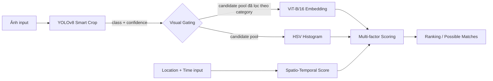

# AI Scope & Technical Constraints Spec

| | |
|---|---|
| **Dự án** | Hệ thống tìm kiếm đồ thất lạc bằng hình ảnh |
| **Loại tài liệu** | Technical Constraint Spec (đầu vào cho đội Req/BA) |
| **Trạng thái** | Draft v1 |
| **Ngày** | 15/09/2026 |
| **Đối tượng đọc** | Req/BA khi vẽ use case, user story, wireframe; QA khi thiết kế test case |

> Nguyên tắc đọc tài liệu này: mọi tính năng liên quan đến AI trong use-case doc **chỉ được vẽ trong phạm vi Mục 4 (Có thể làm)**. Nếu một ý tưởng rơi vào Mục 5 (Không thể/không nên làm), Req không đưa vào scope — hoặc phải note rõ là "Future work, ngoài phạm vi đồ án".

---

## 1. Mục tiêu của AI Layer

AI trả lời **một câu hỏi duy nhất**: *"Với ảnh truy vấn này, những item nào trong DB có khả năng là cùng một vật thể, xếp theo độ tin cậy giảm dần?"*

AI **không** trả lời: "đây có chắc chắn là đồ của người này không" — quyết định đó thuộc về con người (finder approve/reject ở UC12), đúng như nguyên tắc đã chốt ở README mục 16.

---

## 2. Pipeline kỹ thuật đã chốt



### Diễn giải từng bước

| Bước | Vai trò | Input | Output |
|---|---|---|---|
| **YOLOv8 Smart Crop** | Phát hiện và cắt vùng chứa vật thể chính, loại bỏ nền/tay/bàn gây nhiễu | Ảnh gốc | Bounding box, class label (nếu thuộc 80 lớp COCO), confidence, ảnh đã crop |
| **Visual Gating** | Dùng class label từ YOLO để **thu hẹp** tập ứng viên trước khi so sánh vector (không so `backpack` với `bottle`) | Class label + confidence | Candidate pool đã lọc, hoặc "no gating" nếu confidence thấp/class lạ |
| **ViT-B/16 Embedding** | Tính vector ngữ nghĩa (CLIP) để đo độ tương đồng hình dạng/kết cấu tổng thể | Ảnh đã crop (hoặc ảnh gốc nếu fallback) | Vector 512 chiều |
| **HSV Histogram** | Bổ sung tín hiệu màu sắc — CLIP đôi khi bỏ qua khác biệt màu nhỏ | Ảnh đã crop | Histogram vector, tính distance (Bhattacharyya/Chi-square) |
| **Spatio-Temporal Score** | Phạt các cặp lệch xa về địa điểm/thời gian dù ảnh giống nhau | lat/lng + timestamp của 2 item | Điểm 0–100 |
| **Multi-factor Scoring** | Kết hợp trọng số 4 tín hiệu trên thành 1 final score | 4 điểm thành phần | Final Match Score (giống README mục 10) |

---

## 3. Model / thư viện cụ thể

| Thành phần | Model/thư viện | Loại | Cần train? | Ghi chú license/vận hành |
|---|---|---|---|---|
| Detection & crop | YOLOv8n hoặc YOLOv8s (Ultralytics), pretrained COCO | Object detection | Không (zero-shot trên 80 lớp COCO có sẵn) | Ultralytics license AGPL-3.0 — nếu sản phẩm không mở mã nguồn cần license thương mại; với đồ án học thuật OK |
| Embedding | CLIP ViT-B/16 (OpenAI qua `open_clip` hoặc HuggingFace `transformers`) | Vision-language embedding | Không (zero-shot) | Model ~350MB, chạy được CPU nhưng chậm |
| Màu sắc | OpenCV `cv2.calcHist` trên không gian HSV | Thuật toán cổ điển | Không cần model | Không phụ thuộc GPU, cực nhẹ |
| Địa điểm/thời gian | Rule-based (Haversine distance cho lat/lng, decay function theo số ngày lệch) | Công thức, không phải ML | Không | Trọng số hard-code theo README (đã bỏ UI chỉnh trọng số cho admin) |
| Visual Gating | Rule/threshold logic trên output YOLO | Logic điều phối | Không | Xem ngưỡng ở Mục 6 |

---

## 4. AI CÓ THỂ làm (Capabilities — Req được phép vẽ feature dựa trên đây)

- Cắt và chuẩn hoá vùng ảnh chứa vật thể chính trước khi so sánh (giảm nhiễu nền).
- Tính độ tương đồng ngữ nghĩa giữa 2 ảnh vật thể (kể cả khi mô tả text khác nhau — đúng vấn đề cốt lõi ở README mục 3).
- Tính độ tương đồng màu sắc riêng biệt, hiển thị như 1 tiêu chí phụ (vd "Color match: 88%").
- Lọc nhanh candidate pool theo category phát hiện được, giúp hệ thống scale tốt hơn khi dữ liệu lớn.
- Kết hợp 4 tín hiệu (ảnh/màu/vị trí/thời gian) thành **1 điểm số duy nhất có thể giải thích được** (breakdown từng thành phần — dùng cho UC10 "Xem chi tiết đồ vật").
- Trả về **danh sách xếp hạng Top-K**, kèm % similarity cho từng tín hiệu.
- Chạy tự động ở background mỗi khi có bài đăng mới (UC20) mà không cần user chủ động bấm "tìm kiếm".
- Đánh giá được bằng số liệu định lượng (Top-1/Top-5 Accuracy, Precision@K — README mục 18).

## 5. AI KHÔNG THỂ / KHÔNG NÊN làm (Hard constraints)

**Kế thừa từ README (mục 16, 19), giữ nguyên:**
- Không tự khẳng định "đây là đồ của ai" — chỉ xếp hạng độ giống.
- Không nhận diện khuôn mặt, không xử lý camera realtime/video, không tự train model CV từ đầu, không tích hợp mạng xã hội/crawler.

**Ràng buộc phát sinh riêng từ stack đã chọn (Req cần biết để không vẽ quá tay):**

| Giới hạn | Vì sao | Hệ quả cho Req |
|---|---|---|
| YOLOv8 pretrained COCO chỉ có 80 lớp, **không có** ví/wallet, chìa khoá, USB, kính mắt, tai nghe | Model không được train cho các lớp này | Không vẽ feature "tự động nhận diện loại đồ vật" cho các category này; hệ thống sẽ fallback dùng ảnh gốc, không có badge category tự động |
| Hai vật thể **giống hệt nhau** (cùng hãng, cùng mẫu, cùng màu) sẽ luôn có similarity rất cao dù là 2 vật khác nhau | Giới hạn bản chất của mọi visual similarity model, không riêng gì stack này | Đây chính là lý do bắt buộc phải giữ luồng Claim + xác minh thủ công (UC11-12) — Req **không được** thiết kế tính năng "tự động trao đổi mà không cần Claim" dựa trên similarity cao |
| Ảnh mờ, thiếu sáng, bị che khuất nặng → độ chính xác giảm mạnh, không có ngưỡng đảm bảo | Hạn chế input, không phải hạn chế của model | Req nên thiết kế UI hướng dẫn chụp ảnh (đủ sáng, 1 vật/ảnh, không che khuất) như một bước trong UC5/UC6, không phải tính năng AI |
| Không xử lý nhiều vật thể trong 1 ảnh — YOLO chỉ lấy 1 box (confidence/diện tích lớn nhất) | Giữ pipeline đơn giản đúng định hướng README mục 9 | Req không vẽ feature "đăng 1 ảnh chứa nhiều đồ, hệ thống tự tách" |
| Không có OCR — không đọc được chữ khắc/nhãn trên đồ vật | Ngoài phạm vi 5 kỹ thuật đã chọn | Nếu cần, đây là **Future Work**, không đưa vào scope hiện tại |
| Không cam kết % chính xác cố định trong production | Số liệu Top-1/Top-5 chỉ đo trên tập test nhỏ (xem file 03) | Req không viết acceptance criteria dạng "hệ thống phải match đúng 90% mọi trường hợp" |

---

## 6. Ngưỡng & fallback logic (để BE/AI service và Req thống nhất hành vi)

```
YOLO detection confidence >= 0.5  → dùng ảnh đã crop, gating theo class, có category badge
YOLO detection confidence <  0.5
  hoặc class không nằm trong 80 lớp COCO
  hoặc không detect được vật thể nào       → dùng ảnh gốc (không crop), KHÔNG gating theo category,
                                              đánh dấu low_confidence_detection = true
```

`low_confidence_detection = true` nên được BE trả về FE để hiển thị badge dạng "Độ tin cậy phát hiện thấp" ở UC10 — đây là **quyết định UX**, không phải quyết định AI, nhưng Req cần biết field này tồn tại để thiết kế.

---

## 7. Ràng buộc hạ tầng

- CLIP ViT-B/16 + YOLOv8 chạy được trên CPU nhưng chậm hơn đáng kể so với GPU; khuyến nghị có GPU (kể cả GPU consumer-grade) cho môi trường demo/production nhỏ. Cần benchmark thực tế trước khi cam kết SLA latency cụ thể — **không đưa con số latency vào spec ở giai đoạn này**.
- Matching tự động (UC20) phải chạy **bất đồng bộ/background**, không được block API response lúc user vừa đăng bài (UC5/UC6 bước 6 — "kích hoạt auto-matching nền").
- Vector similarity nên luôn được thu hẹp phạm vi theo category/status **trước khi** tính cosine similarity toàn bộ, để không suy giảm hiệu năng khi dữ liệu tăng.

---

## 8. Hợp đồng API giữa Backend (Spring Boot) và AI Service (mẫu tham khảo)

```json
// POST /ai/embed  (BE gọi khi có item mới, hoặc khi search bằng ảnh)
// Request
{
  "imageUrl": "https://storage/.../L102.jpg",
  "itemCategory": "backpack"          // optional, hint nếu user đã chọn category thủ công
}

// Response
{
  "detectedClass": "backpack",
  "detectionConfidence": 0.91,
  "lowConfidenceDetection": false,
  "embedding": [0.0123, -0.0456, ...],  // 512-dim
  "hsvHistogram": [0.02, 0.05, ...]
}
```

```json
// POST /ai/match  (BE gọi khi cần xếp hạng candidate pool)
// Request
{
  "queryItemId": "L102",
  "candidateItemIds": ["F387", "F412", "F291"]
}

// Response
{
  "results": [
    {
      "itemId": "F387",
      "imageSimilarity": 0.94,
      "colorSimilarity": 0.88,
      "locationScore": 1.0,
      "timeScore": 0.95,
      "finalScore": 0.934
    }
  ]
}
```

---

## 9. Tiêu chí đánh giá (kế thừa README mục 18, bổ sung)

- Top-1 Accuracy, Top-5 Accuracy, Precision@K — đo trên tập test riêng (xem file `03-data-feasibility-research.md`).
- **Bổ sung khuyến nghị**: đo riêng theo từng category (đặc biệt category ngoài COCO như wallet/keys) để phát hiện category nào yếu do không có gating hỗ trợ.
- **Bổ sung khuyến nghị**: đo riêng trên tập "hard negatives" (2 vật cùng loại, cùng hãng nhưng là 2 vật khác nhau) để chứng minh hệ thống *không* tự động trả nhầm đồ — đây là số liệu quan trọng để bảo vệ quyết định "vẫn cần Claim thủ công".

---

## 10. Rủi ro kỹ thuật & mitigation

| Rủi ro | Mức độ | Mitigation |
|---|---|---|
| Model nhầm giữa 2 vật giống hệt nhau | Cao, không tránh được hoàn toàn | Giữ nguyên luồng Claim + xác minh thủ công, không tự động hoá bước trao trả |
| 5/10 category gợi ý trong README không có sẵn trong COCO | Trung bình | Fallback "no gating", hoặc fine-tune nhỏ nếu có thời gian (xem file 03) |
| Tập test quá nhỏ (30-50 ảnh/category) → số liệu Top-1/Top-5 có sai số lớn | Trung bình | Báo cáo kèm khoảng tin cậy, không công bố như con số tuyệt đối (xem file 03) |
| Latency cao trên CPU khi không có GPU | Thấp–Trung bình (tuỳ môi trường deploy) | Chạy matching bất đồng bộ, không đưa AI vào critical path của request đăng bài |
