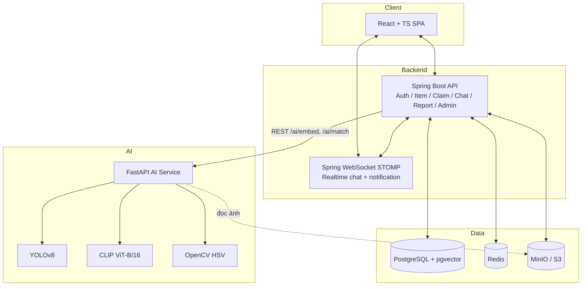

# Tech Stack Decision Record

| | |
|---|---|
| **Dự án** | Hệ thống tìm kiếm đồ thất lạc bằng hình ảnh |
| **Loại tài liệu** | Architecture Decision Record (ADR) |
| **Trạng thái** | Accepted |
| **Ngày** | 15/09/2026 |
| **Ràng buộc đầu vào** | Backend **bắt buộc** Spring Boot (yêu cầu cứng của team, không đàm phán) |

---

## 1. Bối cảnh

Hệ thống có 2 loại workload khác hẳn nhau:
1. **CRUD + business logic + auth + chat + transaction quan hệ** (user, item, claim, chat, report) → phù hợp Java/Spring Boot.
2. **Model inference (YOLOv8, CLIP)** → ecosystem Python (Ultralytics, PyTorch, open_clip) trưởng thành hơn hẳn so với Java (DL4J/ONNX-Java tồn tại nhưng kém tài liệu, kém cộng đồng hơn nhiều so với Python cho 2 model này).

→ Quyết định: **kiến trúc polyglot 2 service**, không cố nhồi AI vào Spring Boot.

---

## 2. Bảng quyết định tổng quan

| Layer | Lựa chọn | Lý do ngắn gọn |
|---|---|---|
| Frontend | React 18 + TypeScript + Vite | SPA quen thuộc, hệ sinh thái lớn, dễ tích hợp realtime chat |
| Styling | TailwindCSS | Tốc độ dev nhanh cho đồ án, không cần design system phức tạp |
| State/data fetching | TanStack Query + Zustand (hoặc Context) | Tách server state / client state rõ ràng |
| Realtime client | STOMP.js (qua SockJS/WebSocket) | Khớp với Spring WebSocket STOMP bên BE |
| **Backend chính** | **Spring Boot 3.x (Java 21)** | Ràng buộc bắt buộc của team, team có kinh nghiệm sẵn |
| Auth | Spring Security + JWT (`jjwt`) | Chuẩn phổ biến, khớp UC1-3 |
| ORM | Spring Data JPA + Hibernate | CRUD nhanh cho quan hệ user-item-claim-chat |
| Migration | Flyway | Version control cho schema, cần thiết vì DB có bảng vector (pgvector) |
| Validation | Jakarta Bean Validation | Validate field ở UC5/UC6 (15 fields) |
| Mapping DTO | MapStruct | Giảm boilerplate entity↔DTO |
| Realtime chat server | Spring WebSocket (STOMP) | Native trong Spring, không cần thêm service riêng cho UC13 |
| **AI Service** | **Python 3.11 + FastAPI** | Native cho Ultralytics YOLOv8 + open_clip/transformers; async tốt |
| Model serving lib | Ultralytics (YOLOv8), `open_clip`/HuggingFace `transformers` (CLIP ViT-B/16), OpenCV (HSV) | Đã chốt ở file 01 |
| Giao tiếp BE ↔ AI Service | REST/JSON qua HTTP nội bộ (docker network) | Đơn giản, dễ debug, đủ cho tải MVP |
| **Database chính** | **PostgreSQL 15/16 + pgvector extension** | Lưu quan hệ + vector embedding trong cùng 1 DB, tránh đồng bộ 2 hệ CSDL |
| Cache / pub-sub | Redis | Session cache, rate-limit, hỗ trợ scale notification/chat nếu multi-instance |
| Object storage | MinIO (self-host, S3-compatible) — có thể đổi sang AWS S3 khi deploy cloud | Lưu ảnh item, tương thích API S3 chuẩn |
| Async job (matching nền — UC20) | Bắt đầu bằng Spring `@Async` + bảng job status trong Postgres; nâng cấp RabbitMQ sau nếu cần | Giữ đơn giản đúng quy mô đồ án, tránh over-engineering |
| Containerization | Docker + docker-compose (dev/demo) | Đủ cho scope đồ án, không cần K8s |
| CI | GitHub Actions | Build & test tự động |

---

## 3. Kiến trúc triển khai tổng thể

---

## 4. Vì sao Spring Boot vẫn hợp lý dù có AI

- Toàn bộ business logic (auth, ownership, state machine LOST→...→CLOSED, claim workflow, report/admin) là CRUD + quy tắc nghiệp vụ chuẩn — đúng sở trường Spring Boot, không có lý do kỹ thuật nào bắt buộc phải viết bằng Python.
- Spring Boot chỉ **gọi** AI service như một dependency ngoài (giống gọi payment gateway), không cần Spring "hiểu" AI — giữ ranh giới rõ ràng, dễ test độc lập từng phần.
- Team có kinh nghiệm Spring Boot sẵn → giảm rủi ro tiến độ cho phần chiếm nhiều effort nhất (business logic, chiếm ưu thế số lượng use case: 15/20 use case không liên quan trực tiếp đến AI).

## 5. Vì sao tách AI service riêng thay vì viết lại bằng Java

- Ultralytics YOLOv8 và CLIP (`open_clip`/`transformers`) là thư viện Python-first; bản Java/ONNX tương đương tồn tại nhưng: ít tài liệu, cộng đồng nhỏ, khó debug khi lỗi — rủi ro cao cho một đồ án có deadline.
- Tách service riêng cho phép **scale độc lập**: AI service cần GPU, backend không cần — không lãng phí tài nguyên nếu deploy chung.
- Ranh giới rõ ràng giúp team chia việc: 1 nhóm làm Spring Boot, 1 nhóm làm AI service, giao tiếp qua API contract đã chốt ở file 01 mục 8.

---

## 6. Phương án thay thế đã cân nhắc và lý do loại bỏ

| Phương án | Lý do loại |
|---|---|
| Milvus / Qdrant (vector DB chuyên dụng) thay vì pgvector | Dataset dự kiến của đồ án nhỏ (hàng trăm–vài nghìn item), pgvector đủ hiệu năng và tránh phải vận hành thêm 1 hệ thống riêng biệt, tránh vấn đề đồng bộ dữ liệu giữa 2 DB |
| Viết toàn bộ bằng Python (Django/FastAPI monolith), bỏ Spring Boot | Vi phạm ràng buộc cứng của team; cũng không tận dụng được kinh nghiệm Spring Boot sẵn có |
| Nhúng model AI trực tiếp vào Spring Boot qua ONNX Runtime Java | Tăng độ phức tạp convert model, giảm khả năng cập nhật model mới nhanh, hệ sinh thái kém hơn hẳn Python cho 2 model đã chọn |
| MongoDB cho toàn hệ thống | Dữ liệu có quan hệ rõ ràng (user–item–claim–chat–report) cần join, hợp với SQL hơn NoSQL; và cần pgvector cho phần AI |
| Kafka cho xử lý matching bất đồng bộ | Quá nặng so với quy mô đồ án ở giai đoạn MVP; `@Async` + job table trong Postgres đủ dùng, có thể nâng cấp sau nếu cần |
| gRPC giữa BE và AI service thay vì REST | Thêm độ phức tạp (proto, codegen) không cần thiết ở quy mô nội bộ 2 service; REST/JSON đủ nhanh và dễ debug hơn trong giai đoạn phát triển |

---

## 7. Việc cần làm tiếp (không thuộc phạm vi tài liệu này)

- Benchmark latency thực tế của AI service (CPU vs GPU) trước khi đưa vào NFR spec.
- Thiết kế schema Postgres chi tiết (bảng `items`, `embeddings` — có thể tách bảng embedding riêng để tối ưu index pgvector).
- Quyết định RabbitMQ có cần thiết hay không sau khi đo tải thực tế của UC20.
