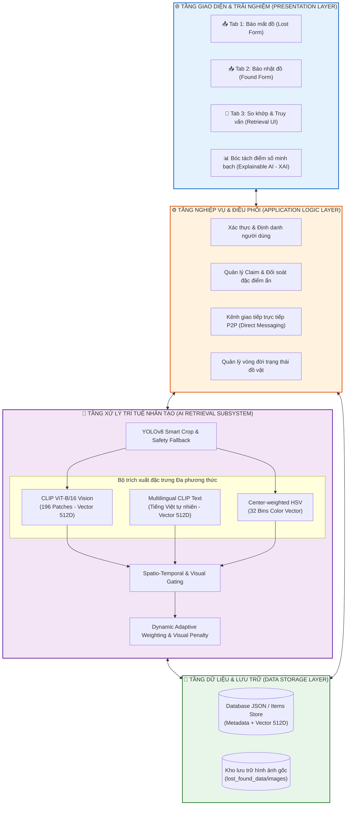
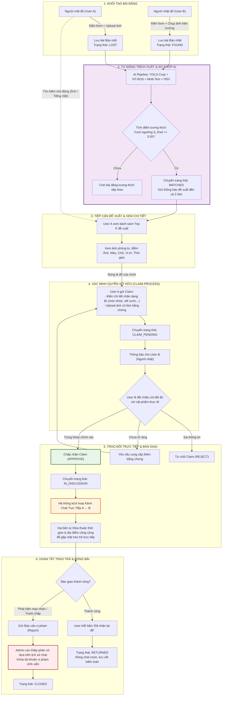

# QUY TRÌNH HOẠT ĐỘNG TOÀN DIỆN HỆ THỐNG (WORKFLOW)
## HỆ THỐNG TÌM KIẾM ĐỒ THẤT LẠC ĐA PHƯƠNG THỨC (LOST & FOUND MANAGEMENT SYSTEM)

---

## 1. TỔNG QUAN HỆ THỐNG

### 1.1. Mục tiêu đề tài
Hệ thống giải quyết bài toán kết nối tập trung, tự động và chuẩn xác giữa **người đánh mất đồ (Lost User)** và **người nhặt được đồ (Found User)**. Thay vì phụ thuộc vào việc tìm kiếm thủ công qua mạng xã hội, hệ thống sử dụng **Kiến trúc AI Đa phương thức lai ghép (Hybrid Asymmetric Multimodal Retrieval)** kết hợp giữa:
- **Thị giác máy tính sâu (Vision):** `YOLOv8 Smart Crop` + `CLIP ViT-B/16` (196 patches không gian) + `Center HSV Color Histogram (32D)`.
- **Ngôn ngữ tự nhiên bản địa (Language):** `Multilingual CLIP Text Encoder` xử lý Tiếng Việt có dấu trực tiếp.
- **Ràng buộc logic vật lý:** Nhân quả thời gian ($t_{\text{found}} \ge t_{\text{lost}} - \epsilon$) và tương đồng không gian địa lý.

### 1.2. Các Actor tham gia vào hệ thống
1. **User (Người dùng phổ thông):**
   - Đóng vai trò kép linh hoạt (*Lost User* khi mất đồ và *Found User* khi nhặt được đồ).
   - Đăng tin báo mất / báo nhặt kèm ảnh hiện trường.
   - Tìm kiếm chủ động bằng hình ảnh hoặc mô tả văn bản tiếng Việt.
   - Nhận thông báo gợi ý tự động từ AI.
   - Gửi yêu cầu nhận lại đồ (Claim) kèm câu trả lời đặc điểm nhận dạng ẩn.
   - Tự đối soát, xác thực claim và nhắn tin trực tiếp để hẹn gặp bàn giao đồ.
2. **Admin (Quản trị viên):**
   - Giám sát luồng hoạt động và thống kê số liệu toàn hệ thống.
   - **Không làm trung gian duyệt từng bài đăng hay từng claim** (tránh nút thắt cổ chai, đảm bảo tốc độ trao trả đồ ngay lập tức).
   - **Chỉ can thiệp khi có tranh chấp:** Tiếp nhận và xử lý báo cáo vi phạm (Report/Dispute) khi phát hiện hành vi mạo nhận hoặc gian lận.

---

## 2. KIẾN TRÚC PHÂN TẦNG TỔNG THỂ (SYSTEM ARCHITECTURE)

---

## 3. SƠ ĐỒ WORKFLOW NGHIỆP VỤ NGƯỜI DÙNG END-TO-END

---

## 4. CHI TIẾT CÁC GIAI ĐOẠN NGHIỆP VỤ

### Giai đoạn 1: Đăng tải bài viết đa phương thức
- **Bài đăng Báo mất đồ (`Lost Item`):**
  - Người mất cung cấp: Tên vật dụng, Mô tả chi tiết (bằng tiếng Việt có dấu tự nhiên), Danh mục, Địa điểm đánh rơi, Ngày giờ làm mất, Thông tin liên hệ, Upload ảnh vật phẩm (nếu có).
  - Trạng thái khởi tạo: `LOST`.
- **Bài đăng Báo nhặt được đồ (`Found Item`):**
  - Người nhặt cung cấp: Tên phỏng đoán, Mô tả hiện trạng, Địa điểm nhặt được, Ngày giờ nhặt, Thông tin liên hệ, Chụp ảnh vật phẩm thực tế tại hiện trường.
  - Trạng thái khởi tạo: `FOUND`.

### Giai đoạn 2: Trích xuất Vector AI & Tự động So khớp ngầm
1. Ngay khi form được gửi, hệ thống tự động kích hoạt **AI Pipeline**:
   - **YOLOv8** khoanh vùng đối tượng chính (RoI), loại bỏ phông nền hoặc tự động fallback giữ nguyên 100% ảnh gốc nếu gặp chìa khóa/người cầm.
   - **CLIP ViT-B/16** trích xuất vector thị giác sâu 512 chiều ($z_{\text{img}}$) với độ mịn 196 patches.
   - **Multilingual CLIP Text Encoder** trích xuất vector ngữ nghĩa tiếng Việt 512 chiều ($z_{\text{txt}}$) từ tên và mô tả tiếng Việt.
   - **Center HSV** tính toán biểu đồ màu sắc 32 chiều ($z_{\text{col}}$) vùng trung tâm.
2. Hệ thống chạy thuật toán so khớp giữa bài mới và toàn bộ kho bài đăng đối ứng:
   - Nếu tồn tại cặp bài viết vượt qua các bộ lọc ràng buộc và đạt điểm tổng hợp $S_{\text{final}} \ge 0.55$, trạng thái được cập nhật thành `MATCHED`.
   - Hệ thống tự động gửi thông báo đến bảng tin của cả hai người dùng.

### Giai đoạn 3: Tiếp cận Đề xuất & Tìm kiếm chủ động
Người dùng có 2 cách tiếp cận:
- **Thụ động:** Nhận danh sách gợi ý tự động từ AI ngay trong mục thông báo.
- **Chủ động:** Sử dụng thanh tìm kiếm:
  - *Tìm bằng Ảnh:* Upload ảnh bất kỳ để AI truy vấn các vật phẩm nhặt được có ngoại quan tương đồng.
  - *Tìm bằng Tiếng Việt:* Nhập từ khóa mô tả tự nhiên (ví dụ: *"chùm chìa khóa xe máy có móc phi hành gia"*).
  - *Bộ lọc kết hợp:* Lọc kết hợp theo Địa điểm + Khoảng thời gian + Ngưỡng điểm ảnh tối thiểu.

### Giai đoạn 4: Quy trình Xác minh Quyền sở hữu (Claim Process)
- Để ngăn ngừa mạo nhận, người dùng **không được bấm nhận đồ tùy tiện**.
- Khi bấm **"Claim Item"**, người mất bắt buộc phải trả lời **Câu hỏi xác minh đặc điểm ẩn**:
  - *Ví dụ:* "Bên trong ngăn phụ có chiếc USB màu xanh", "Móc khóa có vết mẻ ở góc trái", "Số tiền lẻ bên trong ví".
  - Có thể upload thêm ảnh chụp cũ trước đây làm bằng chứng chứng minh quyền sở hữu.
- Trạng thái bài đăng chuyển sang `CLAIM_PENDING`. Trong thời gian này, bài đăng tạm thời ẩn đối với người khác để tránh gửi claim trùng lặp.

### Giai đoạn 5: Đối chiếu trực tiếp giữa 2 người (Peer-to-Peer Verification)
- Người nhặt mở ứng dụng, nhận toàn bộ câu trả lời xác minh của người mất kèm ảnh đối chiếu.
- Người nhặt kiểm tra vật phẩm thực tế đang giữ:
  - **Approve (Chấp nhận):** Thông tin mô tả chi tiết ẩn trùng khớp $\rightarrow$ Kích hoạt phòng chat.
  - **Reject (Từ chối):** Thông tin sai lệch hoàn toàn $\rightarrow$ Hủy claim, đưa bài đăng về lại trạng thái tìm kiếm.
  - **Request More Info (Yêu cầu thêm thông tin):** Cần người mất cung cấp thêm chi tiết rõ ràng hơn.

### Giai đoạn 6: Kênh Chat nội bộ & Bàn giao trực tiếp
- Khi claim được duyệt (`IN_DISCUSSION`), hệ thống tạo một **phòng chat trực tiếp (Direct In-app Chat)** giữa hai người.
- Hai bên trao đổi an toàn:
  - Hẹn thời gian và địa điểm công cộng thuận tiện (sảnh trường học, phòng bảo vệ, văn phòng Đoàn...).
  - Không bắt buộc phải chia sẻ số điện thoại cá nhân hay mạng xã hội riêng tư.

### Giai đoạn 7: Hoàn tất trao trả & Lưu vết kiểm toán
- Sau khi gặp mặt và kiểm tra đúng đồ, người mất đồ bấm **"Đã nhận lại đồ" (Mark as Returned)**.
- Trạng thái bài đăng chuyển thành `RETURNED`.
- Phiên chat tự động đóng lại (chuyển sang chế độ chỉ đọc để lưu vết kiểm toán).
- **Cơ chế xử lý tranh chấp:** Nếu có hành vi gian lận hoặc mạo nhận, một trong hai bên có thể bấm **"Báo cáo vi phạm" (Report)**. Admin sẽ tiếp nhận hồ sơ, tra cứu lịch sử chat và khóa vĩnh viễn tài khoản vi phạm (`CLOSED`).

---

## 5. MA TRẬN CHUYỂN DỊCH TRẠNG THÁI VẬT PHẨM (STATE MACHINE)

| Trạng thái ban đầu | Sự kiện kích hoạt | Tác nhân (Actor) | Trạng thái chuyển đổi | Hành động nghiệp vụ của Hệ thống |
| :--- | :--- | :--- | :--- | :--- |
| *(Khởi tạo)* | Submit form báo mất | User mất đồ | `LOST` | Nạp DB, chạy AI pipeline trích xuất vector 512D |
| *(Khởi tạo)* | Submit form báo nhặt | User nhặt đồ | `FOUND` | Nạp DB, chạy AI pipeline trích xuất vector 512D |
| `LOST` / `FOUND` | AI phát hiện $S_{\text{final}} \ge 0.55$ | AI Engine | `MATCHED` | Gửi thông báo đề xuất Top-K tới 2 tài khoản |
| `FOUND` / `MATCHED` | Gửi Form xác minh chi tiết ẩn | User mất đồ | `CLAIM_PENDING` | Khóa tạm thời quyền gửi claim khác, báo người nhặt |
| `CLAIM_PENDING` | Người nhặt từ chối thông tin | User nhặt đồ | `FOUND` / `MATCHED` | Mở lại bài đăng cho người khác, thông báo lý do cho người mất |
| `CLAIM_PENDING` | Người nhặt chấp nhận thông tin | User nhặt đồ | `IN_DISCUSSION` | Tạo phòng chat trực tiếp A $\leftrightarrow$ B |
| `IN_DISCUSSION` | Xác nhận đã trao trả thành công | User mất/nhặt | `RETURNED` | Đóng bài đăng, đóng phòng chat, lưu vết kiểm toán |
| Bất kỳ | Gửi báo cáo gian lận / tranh chấp | User bất kỳ | `CLOSED` | Chuyển vụ việc cho Admin xử lý, khóa bài đăng |
